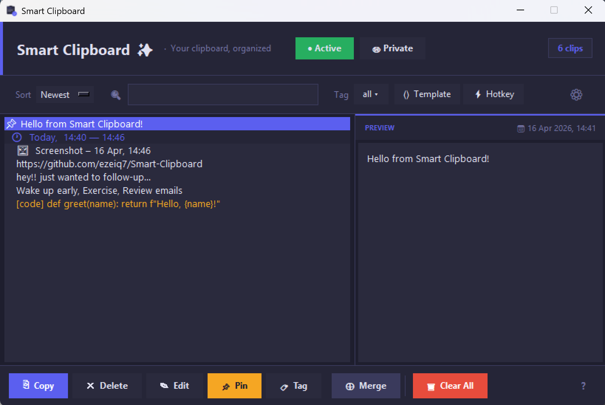

<div align="center">


# Smart Clipboard ✨

**Your clipboard has a memory now.**

Everything you copy is saved, searchable, and one shortcut away.
No accounts. No internet. Everything stays on your device.

[](https://github.com/ezeiq7/smart-clipboard/releases/latest)
[](https://github.com/ezeiq7/smart-clipboard/releases/latest)
[](LICENSE)



</div>

---

## What is Smart Clipboard?

Smart Clipboard is a free Windows clipboard manager that silently 
saves everything you copy and lets you access it instantly — 
without ever switching apps.

Built because every existing clipboard manager was either too 
complex, too ugly, or charged too much.

---

## Features

### Core
- 📋 **Auto-capture** — everything you copy is saved automatically
- 🔍 **Instant search** — find any clip in milliseconds  
- 📌 **Pin clips** — keep important clips at the top forever
- 🏷️ **Tags** — colour-coded organisation for your clips
- 🖼️ **Image support** — screenshots and images saved with preview

### Power Features
- ⚡ **Quick-paste launcher** — press `Ctrl+Shift+V` anywhere for 
  an instant floating search palette. No app switching needed.
- ⟨⟩ **Templates** — save clips with `{placeholders}` that fill 
  in on demand. Perfect for repetitive emails and messages.
- 🔒 **Private mode** — clips stay in memory only, never written 
  to disk. Clears automatically when you're done.
- 🎨 **Syntax highlighting** — code clips display with colour 
  highlighting in the preview panel.
- ⊕ **Merge clips** — select multiple clips and merge 
  them with a custom separator into one paste
- ⌨️ **Double-tap Ctrl** — open the launcher instantly 
  without memorising shortcuts

### Privacy & Safety
- 🛡️ **Sensitive content filter** — passwords, credit cards and 
  SSNs are automatically detected and never saved
- 🚫 **Excluded apps** — configure apps like password managers 
  to never be captured
- 📵 **Zero telemetry** — no internet connection, no tracking, 
  no accounts ever

---

## Installation

**No installer needed — just download and run.**

1. Go to [Releases](https://github.com/ezeiq7/smart-clipboard/releases/latest)
2. Download both `Smart Clipboard.exe` and `SmartClipboard_1.ico`
3. Put both files in the same folder anywhere on your PC
4. Run `Smart Clipboard.exe` once
5. Follow the 30-second onboarding
6. Done — the app starts automatically with Windows from now on

### Requirements
- Windows 10 or Windows 11
- No additional software needed

---

## Keyboard Shortcuts

| Shortcut | Action |
|----------|--------|
| `Ctrl + C` | Saves clips automatically |
| `Ctrl + Alt + C` | Copies and pins selected text |
| `Ctrl + Shift + V` | Opens quick-paste launcher |
| `Ctrl + Shift + E` | Toggles clipboard capture on/off |
| `Ctrl + Shift + X` | Toggles private/incognito mode |
| Double-tap `Ctrl` | Opens Smart Clipboard |
| `↑ / ↓` | Navigate clip list |
| `C` | Copy selected clip |
| `P` | Pin selected clip |
| `E` | Edit selected clip |
| `T` | Tag selected clip |
| `F` | Merge selected clips |
| `M` | Mark as template |
| `Delete` | Delete selected clip |
| `Enter` | Copy and close window |
| `Escape` | Hide to tray |

---

## Privacy

Smart Clipboard is built with privacy as a core feature — not an afterthought.

| Feature | Detail |
|---------|--------|
| **Storage** | All data stored locally in `data/clips.json` |
| **Network** | Zero internet connection required or used |
| **Telemetry** | None — ever |
| **Sensitive filter** | Passwords and card numbers auto-blocked |
| **Private mode** | Clips never touch disk |
| **Excluded apps** | Configure any app to be ignored |

---

## Settings

Open settings via the ⚙ gear icon in the toolbar:

- **Max clips to keep** — 10 to 500, or unlimited
- **Auto-delete after** — 1 hour to 30 days, or never
- **Excluded apps** — comma-separated app names to ignore
- **Launch at startup** — toggle Windows auto-start
- **Global shortcuts** — disable all hotkeys if they conflict
- **Export clips** — save your history as `.json` or `.txt`
- **Replay tutorial** — re-run the onboarding at any time

---

## FAQ

**Will this slow down my PC?**
No. Smart Clipboard runs as a lightweight background process 
and uses minimal CPU and memory.

**Is my clipboard data sent anywhere?**
Never. Everything is stored locally in a JSON file on your 
own computer.

**Can I use this at work?**
Yes. Enable Private mode or turn off capture entirely when 
working with sensitive documents.

**My antivirus flagged it — is it safe?**
Yes. PyInstaller-built executables are sometimes flagged 
by antivirus tools because they bundle a Python interpreter. 
Yes. PyInstaller executables are sometimes flagged by 
antivirus tools. You can verify Smart Clipboard is safe 
by reviewing the full source code in this repository.
Smart Clipboard is safe to use.

**How do I uninstall?**
Delete the exe and the folder. To remove from Windows startup, 
open Settings → disable auto-start, then delete the folder.

---

## Built With

- [Python](https://python.org) — core language
- [Tkinter](https://docs.python.org/3/library/tkinter.html) — UI framework
- [pynput](https://pynput.readthedocs.io) — global keyboard listener
- [pystray](https://pystray.readthedocs.io) — system tray icon
- [Pillow](https://pillow.readthedocs.io) — image support
- [pywin32](https://github.com/mhammond/pywin32) — Windows API

---

## Running from Source
```bash
# Clone the repository
git clone https://github.com/ezeiq7/Smart-Clipboard.git

# Install dependencies
pip install -r requirements.txt

# Run the app
python main.py
```

## Reporting Issues

Found a bug? Have a feature request?

[Open an issue](https://github.com/ezeiq7/smart-clipboard/issues) 
and describe what happened. Include your Windows version and 
what you were doing when the issue occurred.

---

## License

Copyright © 2026 Smart Clipboard


---

<div align="center">

Made with ☕ and way too many late nights

⭐ If Smart Clipboard saves you time, a star means a lot!

</div>