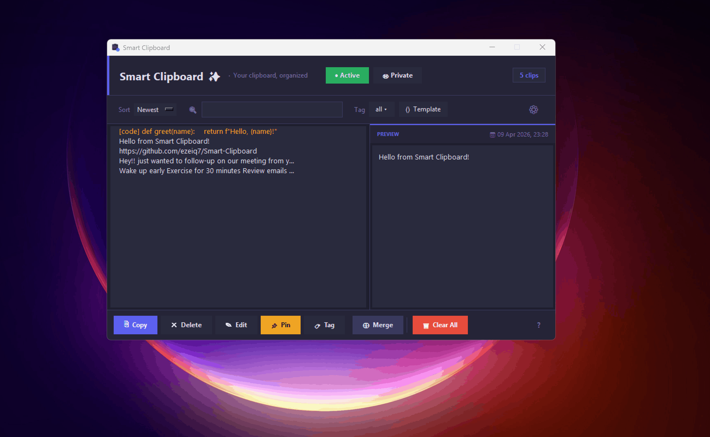

<div align="center">


# Smart Clipboard ✨

**A clipboard that remembers everything, peeks without leaving your app, and pastes smarter in seconds.**

Never lose anything you copy.
Stop re-copying the same things over and over.

👀 **Clipboard Peek** — instantly see what you copied without leaving your app

🕐 **Time Machine** — find anything by remembering when you copied it

✨ **Smart Paste** — instantly clean, fix, and format text before pasting

Private by default. Nothing leaves your device. Ever.

[](https://github.com/ezeiq7/smart-clipboard/releases/latest)
[](https://github.com/ezeiq7/smart-clipboard/releases/latest)
[](LICENSE)

### Full Walkthrough — Time Machine, Clipboard Peek & Split


### Smart Paste


</div>

---

## What is Smart Clipboard?

Smart Clipboard is a free Windows clipboard manager that automatically saves everything you copy and lets you instantly find, preview, and paste it—without ever switching apps.

Built because most clipboard managers are either too complex, too ugly, or overpriced.

---

## Why Smart Clipboard is different

👀 **Clipboard Peek** — hold Ctrl+Shift from anywhere and a floating overlay shows your clipboard without stealing focus. Keep typing while referencing what you copied.

🕐 **Time Machine** — your clips are grouped into work sessions automatically. Find that link you copied this morning without remembering the exact words.

✨ **Smart Paste** — paste messy text as clean formatting, bullet points, UPPERCASE or a single line. One keystroke, perfect output every time.

Works instantly. No setup. Install and go.

No other free clipboard manager does this. No accounts. No tracking. No cloud. Ever.

---

## Features

### Core
- 📋 **Auto-capture** — everything you copy is saved automatically
- 🔍 **Instant search** — find any clip in milliseconds
- 📌 **Pin clips** — keep important clips at the top forever
- 🏷️ **Tags** — colour-coded organisation for your clips
- 🖼️ **Image support** — screenshots and images saved with preview
- 🔎 **Auto code detection** — code clips are automatically tagged and formatting is preserved

### Power Features
- ⚡ **Quick-paste launcher** — press `Ctrl+Shift+V` anywhere for an instant floating search palette with fuzzy search. No app switching needed.
- ✨ **Smart Paste** — when pasting from the launcher, choose how to paste: Plain, Clean (fix quotes & spacing), No Breaks, Bullet List, UPPERCASE, or lowercase. One keystroke, perfect output.
- ⟨⟩ **Templates** — save clips with `{placeholders}` that fill in on demand. Perfect for repetitive emails and messages.
- 🔒 **Private mode** — clips stay in memory only, never written to disk. Clears automatically when you're done.
- ⊕ **Merge clips** — select multiple clips and merge them with a custom separator (newline, comma, space, or custom) into one paste.
- ⌨️ **Double-tap Ctrl** — open Smart Clipboard instantly from anywhere without memorising shortcuts.
- 🎨 **Syntax highlighting** — code clips display with colour highlighting in the preview panel.
- 🔍 **Clipboard Peek** — hold `Ctrl+Shift` from anywhere to instantly preview your clipboard without losing focus. Click to lock the overlay in place, navigate through history with ← → buttons, click text to copy. No other free clipboard manager does this.
- 🕐 **Clipboard Time Machine** — clips are automatically grouped into work sessions by time. Find anything by remembering what you were doing, not what you copied.
- ✂️ **Clipboard Split** — copy a comma-separated list and Smart Clipboard detects it automatically. Press `X` to split into separate clips, bullet list, numbered list or one line instantly.
- 🎯 **Hotkey Clips** — assign any clip to `Ctrl+Shift+1` through `Ctrl+Shift+9` for instant paste from anywhere.

### Privacy & Safety
- 🛡️ **Sensitive content filter** — passwords, credit cards and SSNs are automatically detected and never saved
- 🚫 **Excluded apps** — configure apps like password managers to never be captured
- 📵 **Zero telemetry** — no internet connection, no tracking, no accounts ever

---

## Installation

**No installer needed — just download and run.**

1. Go to [Releases](https://github.com/ezeiq7/smart-clipboard/releases/latest)
2. Download `Smart Clipboard.exe`
3. Place it anywhere on your PC
4. Run it once and follow the 30-second onboarding
5. Done — the app starts automatically with Windows from now on

### Requirements
- Windows 10 or Windows 11
- No additional software needed

---

## Keyboard Shortcuts

### Main App

**CLIPBOARD**

| Shortcut | Action |
|----------|--------|
| `Ctrl + C` | Capture to clipboard |
| `Ctrl + Alt + C` | Capture & pin |
| `Ctrl + Shift + V` | Open quick-paste launcher |
| `Ctrl + Shift + E` | Toggle capture on / off |
| `Ctrl + Shift + X` | Toggle private mode |
| Double `Ctrl` | Open Smart Clipboard |
| `Ctrl + Shift + 1–9` | Paste hotkey clip instantly |
| `Ctrl + Shift` (hold) | Peek at latest clip (click to lock) |

**LIST**

| Shortcut | Action |
|----------|--------|
| `C` | Copy selected |
| `P` | Pin / unpin |
| `T` | Tag selected |
| `M` | Mark / unmark template |
| `F` | Merge selected clips |
| `X` | Split clip into parts |
| `H` | Assign hotkey slot (Ctrl+Shift+1–9) |
| `S` | Focus search bar |
| `E` | Edit selected |
| `B` | Open Settings |
| `Del` | Delete selected |
| `↑ / ↓` | Navigate |
| `Ctrl + ↑ / ↓` | Extend / shrink multi-selection |
| `Enter` | Copy & close |
| `Escape` | Hide to tray |

### Quick-Paste Launcher

| Shortcut | Action |
|----------|--------|
| `↑ / ↓` | Navigate clips |
| `Enter` | Open Smart Paste bar |
| `← / →` | Navigate Smart Paste options |
| `Enter` (in bar) | Paste with selected format |
| `Esc` (in bar) | Close Smart Paste bar |
| Click | Paste plain instantly |
| `Esc` | Dismiss launcher |
| `#tag` | Filter clips by tag |
| any text | Fuzzy search clips |

### Smart Paste Formats

| Format | What it does |
|--------|-------------|
| Plain | Paste exactly as copied |
| Clean | Fix smart quotes, dashes, collapse spaces |
| No Breaks | Remove all line breaks into one line |
| Bullets | Convert each line into a bullet point |
| UPPER | Convert to UPPERCASE |
| lower | Convert to lowercase |

---

## ⟨⟩ Templates — Personalise anything in seconds

Most clipboard tools save fixed text. Smart Clipboard templates have `{placeholders}` that open a fill-in dialog the moment you paste — so every paste is personalised without retyping anything.

```
Hi {name},

Following up on our meeting on {date}.
Please find {document} attached.

Best regards,
Uzair
```

Press copy on this clip → a dialog opens asking for **name**, **date** and **document** → fill them in → perfect personalised message copied instantly. No switching apps. No retyping. No mistakes.

**Perfect for:** Sales emails, Customer support replies, Developer boilerplate, Formal student emails, Any repetitive message you send daily.

**To create a template:** Select any clip → press `M` to mark it as a template → wrap any word in `{curly braces}` to make it a placeholder.

---

## Privacy

Smart Clipboard is built with privacy as a core feature — not an afterthought.

| Feature | Detail |
|---------|--------|
| **Storage** | All data stored locally in `data/clips.json` |
| **Network** | Zero internet connection required or used |
| **Telemetry** | None — ever |
| **Sensitive filter** | Passwords and card numbers auto-blocked |
| **Private mode** | Clips never touch disk |
| **Excluded apps** | Configure any app to be ignored |

---

## Settings

Open settings via the ⚙ gear icon in the toolbar (or press B):

- **Max clips to keep** — 10 to 500, or unlimited
- **Auto-delete after** — 1 hour to 30 days, or never
- **Excluded apps** — comma-separated app names to ignore
- **Launch at startup** — toggle Windows auto-start
- **Global shortcuts** — disable all hotkeys if they conflict
- **Personalize Shortcuts** — enable or disable individual shortcuts independently
- **Clipboard Time Machine gap** — set session grouping to 15, 30 or 60 minutes inactive
- **Export clips** — save your history as `.json` or `.txt`
- **Replay tutorial** — re-run the onboarding at any time

---

## FAQ

**Will this slow down my PC?**
No. Smart Clipboard runs as a lightweight background process
and uses minimal CPU and memory.

**Is my clipboard data sent anywhere?**
Never. Everything is stored locally in a JSON file on your
own computer.

**Can I use this at work?**
Yes. Enable Private mode or turn off capture entirely when
working with sensitive documents.

**My antivirus flagged it — is it safe?**
Yes. PyInstaller executables are sometimes flagged by
antivirus tools. You can verify Smart Clipboard is safe
by reviewing the full source code in this repository.

**How do I uninstall?**
Delete the exe and the folder. To remove from Windows startup,
open Settings → disable auto-start, then delete the folder.

**What is Smart Paste?**
Smart Paste is a feature in the quick-paste launcher that lets
you transform text before pasting. Press Enter on any clip to
open the Smart Paste bar, then choose your format with arrow keys.

**What is Clipboard Peek?**
Hold Ctrl+Shift from anywhere to instantly preview your last copied item without losing focus on your current app. Click the overlay to lock it in place and navigate through clip history with the arrow buttons.

**What is Clipboard Time Machine?**
Your clips are automatically grouped into work sessions based on time gaps. Instead of scrolling through a flat list, you can find clips by remembering what you were working on when you copied them.

---

## What's New in v1.2.0

- **Clipboard Peek** — hold `Ctrl+Shift` from anywhere to instantly preview your clipboard without losing focus. Click to lock the overlay, navigate through clip history with the arrow buttons. No other free clipboard manager does this.
- **Clipboard Time Machine** — clips are automatically grouped into work sessions by time. Find anything by remembering what you were doing, not what you copied.
- **Clipboard Split** — copy a comma-separated list and Smart Clipboard detects it automatically. Press `X` to split into separate clips, bullet list, numbered list or one line instantly.
- **Hotkey Clips** — assign any clip to `Ctrl+Shift+1` through `Ctrl+Shift+9` for instant paste from anywhere, no launcher needed.
- **Personalize Shortcuts** — enable or disable individual global shortcuts independently from the settings panel.
- **Reliability fix** — switched to event-driven clipboard listener, no more missed copies.
- **Revamped onboarding** — new interactive Smart Paste and Clipboard Peek tutorial steps
- **Smarter image labels** — screenshots now show timestamp instead of plain "Image"

---

## Built With

- [Python](https://python.org) — core language
- [Tkinter](https://docs.python.org/3/library/tkinter.html) — UI framework
- [pynput](https://pynput.readthedocs.io) — global keyboard listener
- [pystray](https://pystray.readthedocs.io) — system tray icon
- [Pillow](https://pillow.readthedocs.io) — image support
- [pywin32](https://github.com/mhammond/pywin32) — Windows API
- [psutil](https://psutil.readthedocs.io) — process detection

---

## Running from Source

```bash
# Clone the repository
git clone https://github.com/ezeiq7/Smart-Clipboard.git

# Install dependencies
pip install -r requirements.txt

# Run the app
python main.py
```

---

## Reporting Issues

Found a bug? Have a feature request?

[Open an issue](https://github.com/ezeiq7/smart-clipboard/issues)
and describe what happened. Include your Windows version and
what you were doing when the issue occurred.

---

## License

Copyright © 2026 Smart Clipboard

---

<div align="center">

Made with ☕ and way too many late nights

⭐ If Smart Clipboard saves you time, a star means a lot!

</div>
